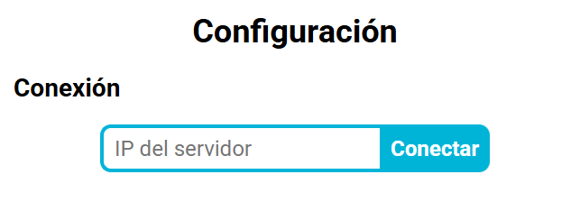
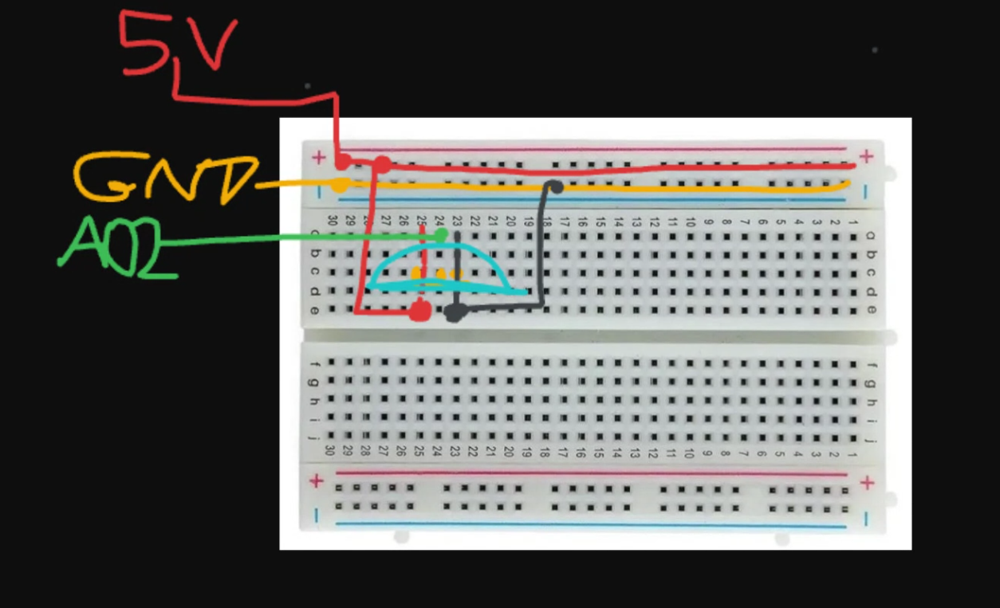

# MeadowApp - Control y Monitoreo de Temperatura

## Temperature Warrior

This project follows a set of temperature ranges given by tuples (min, max, time), and allows to configure and display the ranges with real time data on a web based UI.

Winner of the 2024/25 year competition, achieving an average >90% time in range, and >50% worst case scenario. Can stabilize ranges within a ±0.5ºC tolerance. During round configuration, stabilizes the first range to avoid wasting time during the round. At the mid point of a round, tries to get as close as possible to the next range without leaving the current range. If the intersection between the current and next ranges isn't empty, at the mid point of the range the target is changed to the center of the intersection to avoid going outside the range during the range change.

Uses a PID controller to determine the activation power of a peltier and hair dryer. Sensor is connected through a low-pass filter using a 100μF capacitor and a ~5KΩ resistance.

## Branches

Master branch contains the main code used during tests. Combat branch contains a stripped down version used during the competition. Master branch displays a second graph with the PID controller state during the round (output and individual components), and allows changing the PID constants from the web interface.

## Descripción
Este proyecto implementa una aplicación en C# para dispositivos Meadow que permite el monitoreo y control de la temperatura utilizando un sensor analógico TMP36. Además, se conecta a una red WiFi y proporciona una interfaz basada en WebSockets para recibir comandos y enviar notificaciones de temperatura en tiempo real.

## Funcionalidades Principales

### 1. **Inicialización y Configuración**
   - `Run()`: Método principal que inicia la aplicación, configura los sensores y establece el modo inicial del sistema.
   - `SensorSetup()`: Configura el sensor de temperatura y define la función de callback para manejar las actualizaciones de temperatura.

### 2. **Gestión de Conexión a la Red y Servidor Web**
   - `LaunchNetworkAndWebserver()`: Conecta el dispositivo a una red WiFi y lanza un servidor WebSocket para la comunicación con clientes externos.
   - `ConnectionFinishedHandler()`: Maneja la finalización de la conexión, activando el proceso de apagado si se pierde la conexión.

### 3. **Manejo del Sensor de Temperatura**
   - `TemperatureUpdateHandler()`: Se activa cuando el sensor actualiza su medición, evalúa la temperatura actual y ajusta el actuador si el sistema está en modo de operación.

### 4. **Recepción y Manejo de Comandos**
   - `MessageHandler()`: Procesa los mensajes recibidos a través del servidor WebSocket y gestiona los comandos de configuración, inicio y apagado del sistema.
   - `Shutdown()`: Detiene la ejecución del sistema según el motivo de cancelación recibido.

### 5. **Ejecución de una Ronda de Control de Temperatura**
   - `StartRound()`: Ejecuta una ronda de control basada en los parámetros de temperatura establecidos, registrando tiempos en rango y fuera de rango, y notificando al cliente.

## Instalación y Uso
1. Conectar el dispositivo Meadow.
2. Configurar los datos de la red WiFi en `Secrets.WIFI_NAME` y `Secrets.WIFI_PASSWORD`.
3. Compilar y desplegar la aplicación en el dispositivo.
4. Abrir el archivo TemperatureWarriorCode/Client/www/index.html
5. Si el despliegue ha sido correcto, por terminal debe aparecer una ip:port que deberemos copiar en IP del Servidor (Tened en cuenta que es necesario que vuestra máquina y la Meadow estén conectadas a la misma red WiFi) 

6. Si el mensaje es correcto , se verá en la interfaz cómo la conexión ha sido exitosa. 

## Configuración Sensor TMP36 en ProtoBoard

Si no ha habido ningún problema, se puede observar la temperatura descomentando la línea 164 del fichero [MeadowApp.cs](TemperatureWarriorCode/MeadowApp.cs). 

El siguiente paso es conectar el sensor. En la siguiente imagen se observa la configuración.

La imagen muestra la conexión de un sensor de temperatura TMP36 en una protoboard, con cables que llevan alimentación, tierra y señal hacia una placa Meadow. Aquí está el análisis del setup:

1. Pin de alimentación (VCC, 5V): Cable rojo conectado a la línea de +5V en la protoboard.
2. Pin de tierra (GND): Cable amarillo conectado a la línea de GND en la protoboard.
3. Pin de salida de señal (A02): Cable verde que lleva la señal analógica del sensor hacia la placa Meadow.

